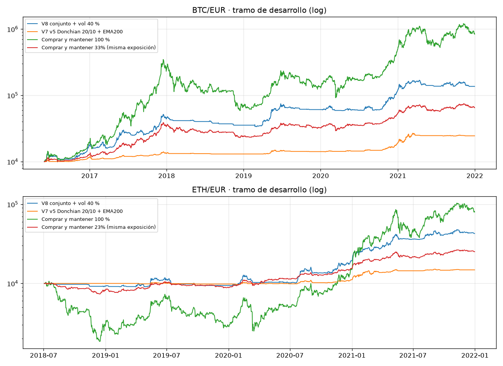

# Fase 2 · Resultados en el tramo de desarrollo

> Dinero ficticio, no es asesoramiento financiero, resultados pasados no garantizan nada.

Criterios fijados antes de ejecutar: [`CRITERIOS.md`](CRITERIOS.md). Solo datos hasta el 2022-01-01 (exclusiva). Costes: comisión 0,80 % y slippage 0,10 % por orden.

## Rendimiento global

| Activo | Estrategia | Rent. total | CAGR | Vol. | Sharpe | Sortino | Máx. DD | Exposición media | Nº ops/episodios | PF | Comisiones € |
|--------|------------|-----------:|-----:|-----:|-------:|--------:|--------:|-----------------:|-----------------:|---:|------------:|
| BTC/EUR | V8 conjunto + vol 40 % | +1,265 % | +59.7 % | 31 % | 1.66 | 2.58 | -35 % | 33% | 13 | 10.67 | 12,035 |
| BTC/EUR | V7 v5 Donchian 20/10 + EMA200 | +145 % | +17.4 % | 12 % | 1.42 | 2.27 | -11 % | — | 22 | 11.75 | 772 |
| BTC/EUR | Comprar y mantener 100 % | +8,273 % | +120.9 % | 78 % | 1.41 | 2.10 | -83 % | 100% | 1 | inf | 6,832 |
| BTC/EUR | Comprar y mantener 33% (misma exposición) | +552 % | +39.9 % | 26 % | 1.40 | 2.08 | -41 % | 34% | 1 | inf | 652 |
| BTC/EUR | Efectivo | +0 % | +0.0 % | 0 % | 0.00 | 0.00 | 0 % | — | — | — | — |
| ETH/EUR | V8 conjunto + vol 40 % | +328 % | +51.5 % | 30 % | 1.53 | 2.44 | -21 % | 23% | 9 | 26.67 | 1,688 |
| ETH/EUR | V7 v5 Donchian 20/10 + EMA200 | +48 % | +12.0 % | 11 % | 1.10 | 1.66 | -10 % | — | 13 | 10.74 | 261 |
| ETH/EUR | Comprar y mantener 100 % | +701 % | +81.3 % | 97 % | 1.11 | 1.61 | -83 % | 100% | 1 | inf | 725 |
| ETH/EUR | Comprar y mantener 23% (misma exposición) | +152 % | +30.3 % | 23 % | 1.28 | 1.91 | -28 % | 23% | 1 | inf | 220 |
| ETH/EUR | Efectivo | +0 % | +0.0 % | 0 % | 0.00 | 0.00 | 0 % | — | — | — | — |

## Rendimiento por régimen

### Tendencia

**BTC/EUR**

| Régimen | Días | % días | Exposición V8 | V8 rent. anual | V8 Sharpe | V7 rent. anual | Mercado rent. anual | Mercado Sharpe |
|---------|-----:|-------:|--------------:|---------------:|----------:|---------------:|--------------------:|---------------:|
| alcista | 1276 | 63 % | 43% | +65 % | 1.82 | +23 % | +122 % | 1.58 |
| bajista | 408 | 20 % | 11% | +8 % | 0.53 | +0 % | +59 % | 0.75 |
| mixto | 356 | 17 % | 23% | +52 % | 2.03 | +14 % | +125 % | 1.61 |

**ETH/EUR**

| Régimen | Días | % días | Exposición V8 | V8 rent. anual | V8 Sharpe | V7 rent. anual | Mercado rent. anual | Mercado Sharpe |
|---------|-----:|-------:|--------------:|---------------:|----------:|---------------:|--------------------:|---------------:|
| alcista | 719 | 56 % | 34% | +62 % | 1.70 | +18 % | +122 % | 1.24 |
| bajista | 360 | 28 % | 5% | +3 % | 0.25 | -1 % | +17 % | 0.17 |
| mixto | 198 | 16 % | 16% | +67 % | 2.36 | +12 % | +223 % | 2.55 |

### Volatilidad

**BTC/EUR**

| Régimen | Días | % días | Exposición V8 | V8 rent. anual | V8 Sharpe | V7 rent. anual | Mercado rent. anual | Mercado Sharpe |
|---------|-----:|-------:|--------------:|---------------:|----------:|---------------:|--------------------:|---------------:|
| alta | 774 | 38 % | 24% | +24 % | 0.82 | +11 % | +147 % | 1.55 |
| baja | 299 | 15 % | 48% | +110 % | 2.95 | +31 % | +133 % | 2.42 |
| media | 967 | 47 % | 36% | +56 % | 1.83 | +17 % | +73 % | 1.08 |

**ETH/EUR**

| Régimen | Días | % días | Exposición V8 | V8 rent. anual | V8 Sharpe | V7 rent. anual | Mercado rent. anual | Mercado Sharpe |
|---------|-----:|-------:|--------------:|---------------:|----------:|---------------:|--------------------:|---------------:|
| alta | 263 | 21 % | 12% | +25 % | 1.10 | +26 % | +156 % | 1.22 |
| baja | 580 | 45 % | 27% | +77 % | 2.39 | +12 % | +147 % | 1.84 |
| media | 434 | 34 % | 24% | +18 % | 0.57 | +3 % | +27 % | 0.28 |

### Fuerza

**BTC/EUR**

| Régimen | Días | % días | Exposición V8 | V8 rent. anual | V8 Sharpe | V7 rent. anual | Mercado rent. anual | Mercado Sharpe |
|---------|-----:|-------:|--------------:|---------------:|----------:|---------------:|--------------------:|---------------:|
| debil | 1045 | 51 % | 21% | +13 % | 0.75 | +6 % | +44 % | 0.62 |
| fuerte | 995 | 49 % | 46% | +92 % | 2.26 | +28 % | +179 % | 2.15 |

**ETH/EUR**

| Régimen | Días | % días | Exposición V8 | V8 rent. anual | V8 Sharpe | V7 rent. anual | Mercado rent. anual | Mercado Sharpe |
|---------|-----:|-------:|--------------:|---------------:|----------:|---------------:|--------------------:|---------------:|
| debil | 632 | 49 % | 17% | +26 % | 1.18 | +5 % | +59 % | 0.64 |
| fuerte | 645 | 51 % | 29% | +66 % | 1.81 | +18 % | +156 % | 1.55 |

## Aplicación de los criterios (variante 8)

**Tendencia** (alcista - bajista): diferencia anual +59 puntos, IC 90 % [+23, +92] · signos por submuestra {'BTC/EUR mitad 1': 1, 'BTC/EUR mitad 2': -1, 'ETH/EUR mitad 1': -1, 'ETH/EUR mitad 2': 1, 'BTC/EUR': 1, 'ETH/EUR': 1} · insuficiente: ['bajista en ETH/EUR mitad 2 (13 días)'] · **(A) no cumple**

- alcista: media anual +64 %, IC 90 % [+33, +95] · (B) no cumple
- bajista: media anual +6 %, IC 90 % [-9, +23] · (B) no cumple · submuestras con menos de 60 días: ETH/EUR mitad 2
- mixto: media anual +57 %, IC 90 % [+13, +107] · (B) no cumple · submuestras con menos de 60 días: ETH/EUR mitad 2

**Volatilidad** (alta - baja): diferencia anual -64 puntos, IC 90 % [-117, -10] · signos por submuestra {'BTC/EUR mitad 1': -1, 'BTC/EUR mitad 2': -1, 'ETH/EUR mitad 1': -1, 'ETH/EUR mitad 2': -1, 'BTC/EUR': -1, 'ETH/EUR': -1} · insuficiente: no · **(A) CUMPLE**

- alta: media anual +24 %, IC 90 % [-4, +55] · (B) no cumple
- baja: media anual +88 %, IC 90 % [+44, +134] · (B) no cumple
- media: media anual +44 %, IC 90 % [+12, +75] · (B) no cumple

**Fuerza** (fuerte - debil): diferencia anual +64 puntos, IC 90 % [+26, +101] · signos por submuestra {'BTC/EUR mitad 1': 1, 'BTC/EUR mitad 2': 1, 'ETH/EUR mitad 1': 1, 'ETH/EUR mitad 2': 1, 'BTC/EUR': 1, 'ETH/EUR': 1} · insuficiente: no · **(A) CUMPLE**

- debil: media anual +18 %, IC 90 % [-0, +36] · (B) no cumple
- fuerte: media anual +82 %, IC 90 % [+47, +116] · (B) no cumple

## Veredicto

**Fase 3 JUSTIFICADA** según los criterios pre-registrados.

## Interpretación (escrita DESPUÉS de ver los resultados)

1. **Revisión de errores antes de presentar.** Los Profit Factor de 10-27
   parecían sospechosos. Revisados episodio a episodio: son 13 episodios en BTC
   y 9 en ETH, con pocas tendencias largas muy ganadoras (+132 %, +65 %, +74 %,
   +138 % en BTC) y muchas pérdidas pequeñas (de -1 % a -6 %). Es el perfil
   típico del seguimiento de tendencia en un tramo con tres grandes mercados
   alcistas. La primera orden se verificó a mano contra los datos. No se
   encontró lookahead.
2. **Muestra.** Con 13 + 9 episodios, las métricas por operación (PF, Win Rate)
   son **insuficientes para concluir**. Las conclusiones se apoyan en
   rentabilidades diarias.
3. **(A) se cumple en volatilidad y en fuerza, pero con una parte mecánica.** La
   exposición de la V8 es mayor en baja volatilidad (por construcción del
   objetivo de volatilidad: 48 % frente a 24 % en BTC) y en tendencia fuerte
   (más sistemas en tendencia). La métrica pre-registrada (rentabilidad media)
   no corrige por exposición. Mirando el Sharpe, que sí lo hace, la V8 empeora
   en alta volatilidad (BTC 0,82 frente a 2,95; ETH 1,10 frente a 2,39) más que
   el propio mercado (BTC 1,55 frente a 2,42), así que hay algo más que exposición.
4. **(B) no se cumple en ningún régimen.** No hay ningún régimen en el que la V8
   pierda dinero de forma fiable: en tendencia débil gana un +18 % anual
   (IC 90 % [-0, +36]) y en alta volatilidad un +24 % ([-4, +55]). Apagarla en
   esos regímenes renunciaría, en desarrollo, a rentabilidad positiva.
5. **Pruebas múltiples.** Se evaluaron 3 comparaciones (A) y 8 regímenes (B) al
   90 %: por azar cabría esperar alrededor de un falso positivo. Que los signos
   coincidan en las 4 mitades y en los 2 activos hace improbable que los dos
   (A) sean solo azar, pero no lo descarta.
6. **Rendimiento global en desarrollo** (no es fuera de muestra). Frente a comprar
   y mantener con la misma exposición media, la V8 tiene más rentabilidad y
   menos caída máxima en los dos activos. Frente a comprar y mantener al 100 %,
   tiene mejor Sharpe y una caída máxima mucho menor (-35 % frente a -83 % en
   BTC), pero bastante menos rentabilidad absoluta (CAGR del 60 % frente al
   121 % en BTC). Es un tramo excepcionalmente alcista (BTC x84), muy favorable
   al seguimiento de tendencia.
7. **Frecuencia esperada.** En desarrollo, unos 2,3 episodios por año en BTC y
   2,6 en ETH, y unas 24 órdenes al año por activo (entradas, reajustes y
   salidas). En 90 días caben **0 o 1 entrada nueva por activo** y una docena de
   órdenes en total. Los 90 días demostrarán el proceso, no la rentabilidad.
