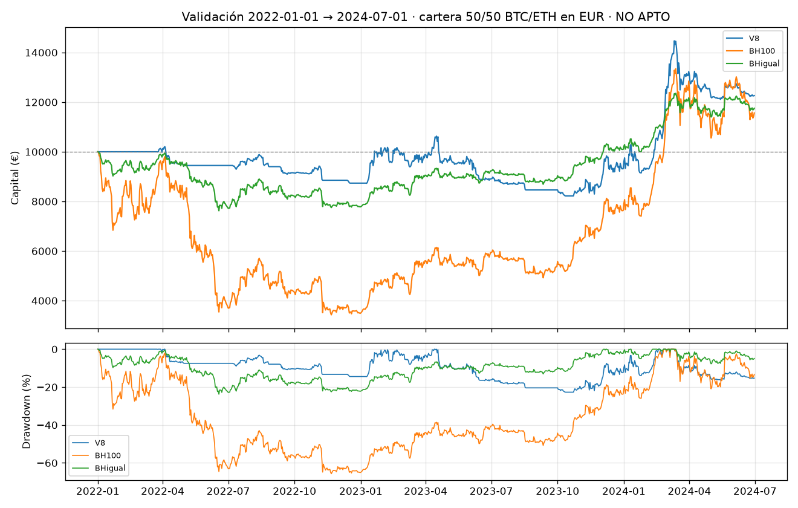

# Validación (apertura única) · veredicto: **NO APTO**

> Dinero ficticio, no es asesoramiento financiero, resultados pasados no garantizan nada.

Ventana 2022-01-01 → 2024-07-01 (exclusiva). Abierta con el commit `e594140e4a` según [`CRITERIOS_ACEPTACION.md`](CRITERIOS_ACEPTACION.md) (versión 1). Cartera 50/50 empezando sin posición. Variantes probadas: 8.

## Cartera

| | Rent. total | CAGR | Vol. | Sharpe | Sortino | Máx. DD |
|---|---:|---:|---:|---:|---:|---:|
| V8 | +22.6 % | +8.5 % | 22 % | 0.48 | 0.72 | -23 % |
| Comprar y mantener 100 % | +15.7 % | +6.0 % | 57 % | 0.39 | 0.55 | -66 % |
| Comprar y mantener con la misma exposición | +17.5 % | +6.7 % | 17 % | 0.46 | 0.66 | -24 % |
| V8 con costes x2 | +9.1 % | +3.5 % | 22 % | 0.27 | 0.39 | -25 % |
| Efectivo | +0.0 % | +0.0 % | 0 % | — | — | 0 % |

## Por activo

| Activo | Estrategia | Rent. total | CAGR | Vol. | Sharpe | Sortino | Máx. DD |
|---|---|---:|---:|---:|---:|---:|---:|
| BTC/EUR | V8 | +21.9 % | +8.3 % | 23 % | 0.46 | 0.70 | -25 % |
| BTC/EUR | BH100 | +36.5 % | +13.3 % | 53 % | 0.50 | 0.72 | -64 % |
| BTC/EUR | BHigual | +24.9 % | +9.3 % | 18 % | 0.59 | 0.86 | -26 % |
| ETH/EUR | V8 | +23.4 % | +8.8 % | 24 % | 0.47 | 0.70 | -24 % |
| ETH/EUR | BH100 | -5.2 % | -2.1 % | 66 % | 0.30 | 0.43 | -72 % |
| ETH/EUR | BHigual | +10.2 % | +4.0 % | 18 % | 0.30 | 0.44 | -25 % |

| Activo | Episodios | Órdenes | Exposición media | Comisiones |
|---|---:|---:|---:|---:|
| BTC/EUR | 9 | 51 | 34% | 545 € |
| ETH/EUR | 8 | 51 | 28% | 443 € |

## Regímenes de tendencia (días de BTC y ETH juntos)

| Régimen | Días | V8 rent. anual media | BH100 rent. anual media |
|---|---:|---:|---:|
| alcista | 847 | +23 % | +53 % |
| bajista | 610 | +5 % | -15 % |
| mixto | 365 | -6 % | +18 % |

## Criterios

- C1 rentabilidad > 0: +22.6 % → ✅ se cumple
- C2 caída máxima ≤ 50 % de la de BH100: -23 % frente a -66 % → ✅ se cumple
- C3 Sharpe > BH100 y > BHigual: 0.48 frente a 0.39 y 0.46 → ✅ se cumple
- C4 coherencia por activo: BTC/EUR rent. +21.9 %, Sharpe 0.46 frente a 0.59; ETH/EUR rent. +23.4 %, Sharpe 0.47 frente a 0.30 → ❌ NO se cumple
- C5 rentabilidad > 0 con costes x2: +9.1 % → ✅ se cumple
- C6 meseta en desarrollo: ✅ se cumple
- C7 regímenes: bajista V8 +5 % frente a BH100 -15 %; alcista V8 +23 % → ✅ se cumple
- S1 Sharpe deflactado (8 variantes) ≥ 0,90: 0.24 → ❌ NO se cumple
- S2 P(Sharpe V8 > BHigual) ≥ 0,80: 0.49 → ❌ NO se cumple (P frente a BH100: 0.53)

Episodios en la validación: 17. Con menos de 30, las métricas por operación son **insuficientes para concluir**; el veredicto se apoya en rentabilidades diarias.

## Veredicto: **NO APTO**

## Interpretación (escrita DESPUÉS de ver los resultados)

- **Se comprobó que no hubiera un error antes de aceptarlo.** Las comisiones
  (987 €, un 9,9 % del capital) explican la diferencia con costes x2, y la
  V8 se queda fuera del mercado hasta abril de 2022, mientras el mercado
  caía. El resultado es real.
- **Falla C4.** En BTC, la V8 (Sharpe 0,46) queda por debajo de comprar y
  mantener un 34 % fijo (0,59). En ETH sí lo supera (0,47 frente a 0,30).
- **Lo que sí hizo:** ganó dinero (+22,6 %), recortó la caída máxima a un
  tercio de la de comprar y mantener (-23 % frente a -66 %), protegió en los
  días bajistas y resistió costes x2.
- **Lo que no demostró:** ventaja sobre la alternativa trivial de tener
  invertido ~30 % de forma fija. Sharpe 0,48 frente a 0,46; probabilidad del
  0,49 de ser mejor, es decir, una moneda al aire. Sharpe deflactado de 0,24.
  Esa alternativa necesitó 2 órdenes; la V8, 102 órdenes y 987 € de comisiones.
- **Lección para la serie:** en este periodo, casi todo el beneficio de la V8
  frente a comprar y mantener se explica por **tener menos exposición**, no
  por acertar el momento.
- El tramo de reserva (2024-07-01 → 2026-05-01) **sigue cerrado**.
